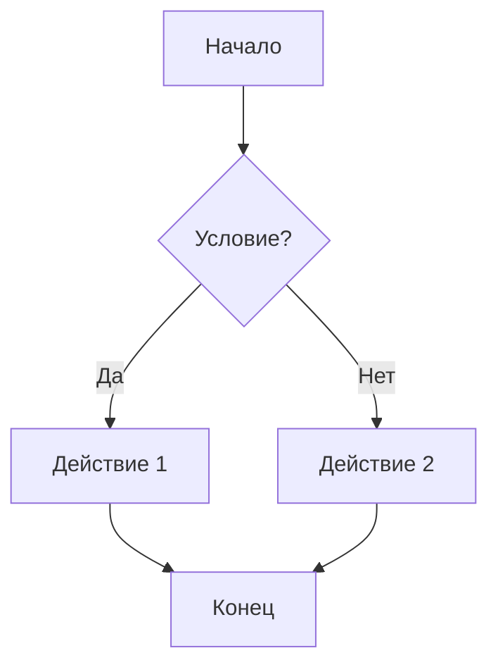

# 🌟 Markdown Demo — Полные возможности языка

Markdown — это лёгкий язык разметки, используемый для форматирования текста.  
Этот файл демонстрирует все его основные возможности.

---

## 1. Заголовки

# Заголовок H1
## Заголовок H2
### Заголовок H3
#### Заголовок H4
##### Заголовок H5
###### Заголовок H6

---

## 2. Форматирование текста

**Жирный текст**  
*Курсив*  
***Жирный курсив***  
~~Зачёркнутый текст~~  
<u>Подчёркнутый текст (через HTML)</u>  
`Моноширинный текст`  

> 💡 Цитата: «Markdown делает документацию красивой.»

---

## 3. Списки

### • Маркированный список
- Элемент 1
  - Вложенный элемент
    - Ещё глубже
- Элемент 2

### • Нумерованный список
1. Первый элемент
2. Второй элемент
   1. Вложенный
   2. Подвложенный
3. Третий элемент

### • Чекбоксы (GitHub Flavored)
- [x] Завершено
- [ ] В процессе
- [ ] Планируется

---

## 4. Ссылки и изображения

[Ссылка на GitHub](https://github.com)  
Автоматическая ссылка: <https://openai.com>


---

## 5. Код и подсветка синтаксиса

Встроенный код: `print("Hello, world!")`

Блок кода (Python):
```python
def greet(name):
    print(f"Hello, {name}!")

greet("Markdown")
```

Блок кода (C++):
```cpp
#include <iostream>
using namespace std;

int main() {
    cout << "Hello, Markdown!" << endl;
    return 0;
}
```

---

## 6. Таблицы

| № | Имя         | Возраст | Город         |
|---|--------------|----------|---------------|
| 1 | Анна         | 25       | Москва        |
| 2 | Иван         | 30       | Санкт-Петербург |
| 3 | Джон         | 22       | Лондон        |

Выравнивание столбцов:

| Влево | По центру | Вправо |
|:------|:----------:|------:|
| текст | текст      | текст |

---

## 7. Горизонтальные линии

---
***
___

---

## 8. Встроенный HTML

<div style="background:#222;color:#fff;padding:10px;border-radius:8px">
  Этот блок оформлен при помощи <b>HTML</b>.
</div>

---

## 9. Эмодзи и спецсимволы

😀 😎 🚀 ❤️ ✨  
Использование HTML-кодировки: `&copy;`, `&mdash;`, `&rarr;` → © — →

---

## 10. Цитаты и вложенные блоки

> Основная цитата
>> Вложенная цитата
>>> Ещё глубже

---

## 11. Формулы (LaTeX / KaTeX)

Встроенная формула: $E = mc^2$

Блочная формула:
$$
\int_0^{2\pi} \sin(x) \, dx = 0
$$

---

## 12. Списки определений

Термин 1  
: Определение первого термина

Термин 2  
: Подробное описание второго

---

## 13. Сноски

Текст со сноской [^1].

[^1]: Это пример сноски.

---

## 14. Вставка задач или цитат с кодом

> **Задача:** Написать программу, которая выводит "Hello".  
> **Решение:**
> ```bash
> echo "Hello"
> ```

---

## 15. Диаграммы (Mermaid)



---

## 16. Встраивание изображений в таблицу

| Иконка | Название |
|:--:|:--|
|  | Python |
|  | Java |
|  | Linux |

---

## 17. Комбинирование Markdown и HTML

<p align="center">
  
  <br>
  <b>Центрированный элемент</b>
</p>

---

## 18. Вложенные списки с кодом

- Сервер
  - Backend
    ```js
    app.get("/", (req, res) => res.send("Hello!"));
    ```
  - Database
    ```sql
    SELECT * FROM users;
    ```
- Frontend
  ```html
  <h1>Hello World</h1>
  ```

---

## 19. Таблица со встроенным кодом

| Язык | Пример |
|------|--------|
| Python | `print("Hello")` |
| JS | `console.log("Hello")` |
| Bash | `echo Hello` |

---

## 20. Комментарии

<!-- Это комментарий, который не будет виден в итоговом HTML -->

---

# ✅ Конец демонстрации

> Этот документ охватывает почти все возможности Markdown, включая GFM, LaTeX и встроенный HTML.
